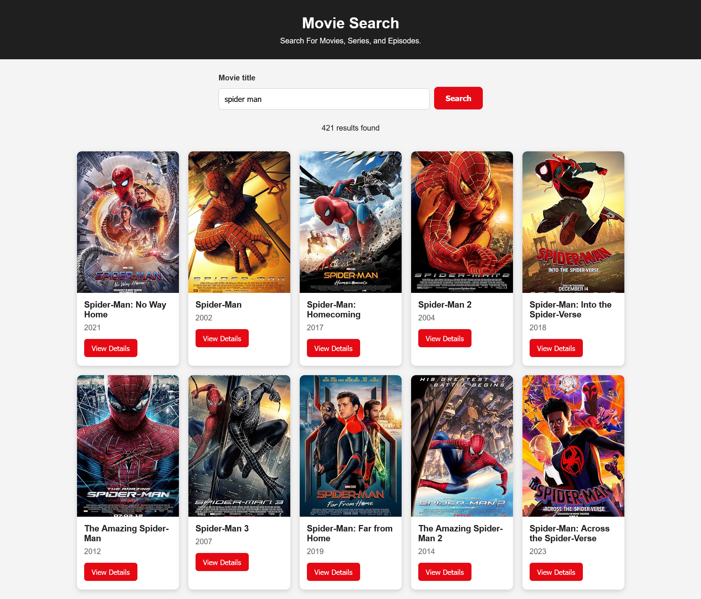
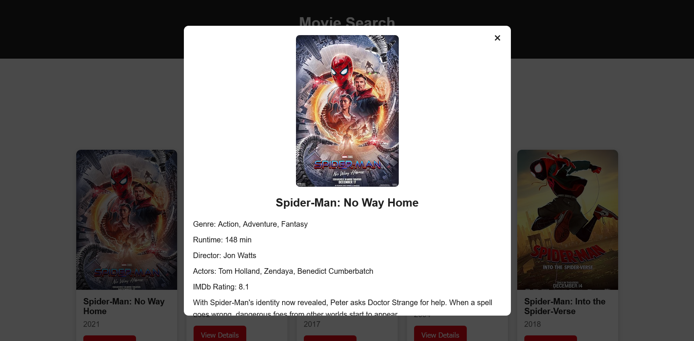

# 🎬 Movie Search App

A responsive movie search application built with HTML, CSS, and JavaScript using the OMDb API that allows users to search for movies. Users can browse movie results and view detailed information about each movie in a modal window.

## Features

- Search movies by title
- Display movie posters, titles, and release years
- View detailed movie information
- Responsive design for desktop and mobile
- Loading spinner while fetching data
- Handles missing posters
- Input validation
- Error handling

## Technologies Used

- HTML5
- CSS3
- JavaScript (ES6)
- OMDb API

## Project Structure

```
movie-search-app/
│
├── assets/
│   └── screenshots/
│       ├── search-results.png
│       └── movie-details.png
│
├── css/
│   └── style.css
│
├── js/
│   └── app.js
│
├── index.html
└── README.md
```

## How to Run

1. Clone or download this repository.
2. Get a free API key from https://www.omdbapi.com/apikey.aspx
3. Open `js/app.js`.
4. Replace the placeholder with your API key:

```javascript
const API_KEY = "YOUR_API_KEY";
```

5. Open `index.html` in your browser.

## API

This project uses the **OMDb API** to search for movies and retrieve movie details.

https://www.omdbapi.com/

## Screenshots

### Search Results



### Movie Details



## Future Improvements

- Pagination
- Search suggestions
- Filter by movie type
- Sort search results
- Favorite movies
- Dark mode

## Author

Developed as part of a JavaScript internship practical project.
